# Deploy and Run Custom App Image for Tibco ActiveSpaces Application on Tibco Platform.


## Description

This example demonstrates how you can build Flogo applications with all dependencies preinstalled outside TIBCO Platform by using
custom Docker images.
This approach provides the capability to:
* Deploy applications directly to TIBCO Platform without requiring Internet access to Flogo provisioner.
* Eliminate the need to provisioning Flogo Connectors and supplements separately in your Data Plane.
* Create lightweight application images based on Ubuntu, instead of using the default Amazon Linux image.

You can create Docker images that include all required application dependencies, build your application, and import the build.zip file to TIBCO Platform.

 In the attached Docker file, we are installing the runtime dependencies for Tibco ActiveSpaces app. 

The main purpose of this sample is:
* To deploy your own custom application image with all dependencies preinstalled directly on TIBCO Platform.


## Prerequisites

1. Ensure that docker is up and running. Here will be using Docker for creating application image.
2. In order to create Docker image locally make sure Docker file, start.sh file and Tibco ActiveSpaces app linux binary should be present at same location.

## Build a Docker image with all required dependencies

1. Create a folder and place your Tibco ActiveSpaces app linux binary, Docker file and start.sh file in it. And open terminal from this location.

2. Build Tibco ActiveSpaces app image using below command:
    
    `docker build -t  activespacesapp .`

    Here docker reads the Dockerfile to create an image and tags it with the name activespaceapp
    
    > **Note:** There is a dot (.) at the end of the command that represents the current directory, which contains the Dockerfile and other files used during the build.

    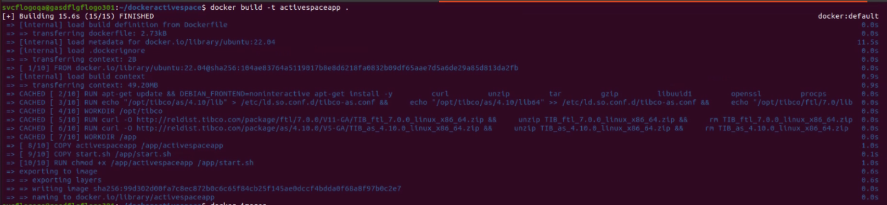

3. Check for activespaceapp image is created or not using below command:
    
    `docker images`

    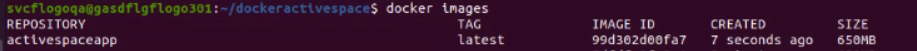

5. Run activespaceapp docker image using below command:
    
    `docker run -e REALM_URL=https://gasdflgflogo301.dev.tibco.com:8443 activespaceapp:latest`

    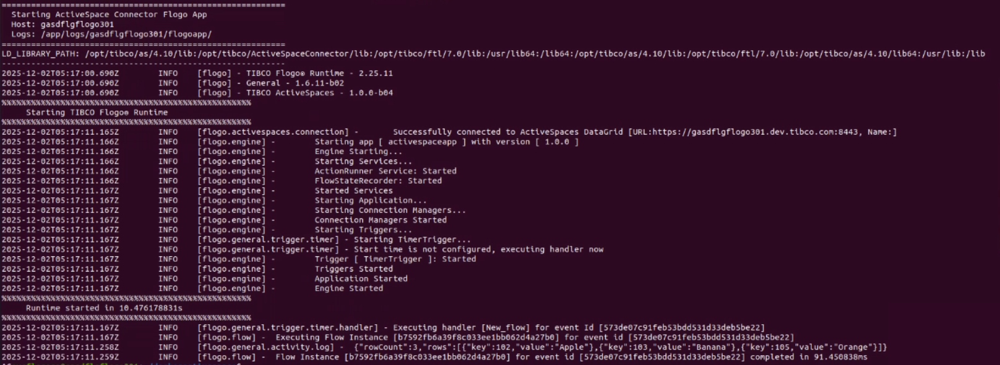


## Push the Application Image to a docker registry of your choice.

Here we are pushing the Docker image to AWS ECR.
1. Log in to AWS ECR
   Make sure you have run:
    aws configure

 2. Then log in:

    aws ecr get-login-password --region <region> \
|   docker login --username AWS --password-stdin    <aws_account_id>.dkr.ecr.<region>.amazonaws.com

   Example:

     aws ecr get-login-password --region us-west-2 | docker login --username AWS --password-stdin 970813828366.dkr.ecr.us-west-2.amazonaws.com

  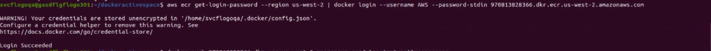

3. Tag and Push your Docker Image

  * Tag your existing image:

   docker tag activespacesapp:latest <aws_account_id>.dkr.ecr.<region>.amazonaws.com/activespacesapp

   Example:

   docker tag activespaceapp:latest 970813828366.dkr.ecr.us-west-2.amazonaws.com/vinaytest:activespaceapp

   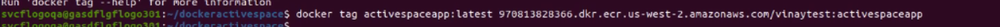

  * Push the image to ECR:

   docker push <aws_account_id>.dkr.ecr.<region>.amazonaws.com/activespacesapp

   Example:

   docker push 970813828366.dkr.ecr.us-west-2.amazonaws.com/vinaytest:activespaceapp
   
   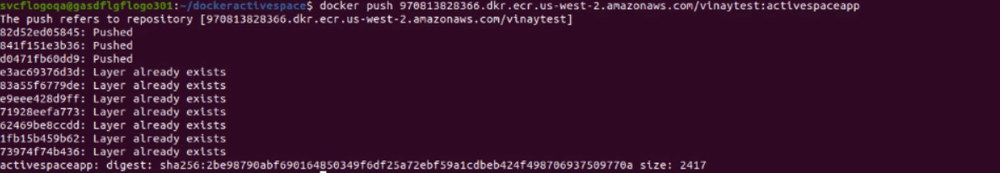

3. Fully Qualified Image Name Example
   970813828366.dkr.ecr.us-west-2.amazonaws.com/vinaytest:activespaceapp

4. Create Kubernetes Secret for AWS ECR (imagePullSecret)

   kubectl create secret docker-registry <secret_name> \
  --docker-server=https://<aws_account_id>.dkr.ecr.<region>.amazonaws.com \
  --docker-username=AWS \
  --docker-password=$(aws ecr get-login-password --region <region>) \
  --docker-email=your@email.com \
  --namespace=<your-k8s-namespace>

  Note:

  * Public ECR images do NOT require authentication.

  * Private ECR images require imagePullSecrets in your deployment YAML.

  ## Build application with FQImage 

1. Create a context by specifying the appropriate flags using TIBCO Flogo® - App Build Command Line Interface and TIBCO Flogo® Extension for Visual Studio Code version 1.3.2 or higher.

      > **eg:** flogobuild create-context -n "<context-name>" -v "<path-to-.vsix file>" --set-default

    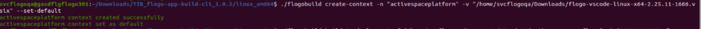  

2. After creating the context, create the TIBCO Platform deployment zip file for your Flogo application using Flogo® - App Build Command Line Interface (CLI).

      > **eg:** flogobuild build-tp-deployment -f "<path-to-flogo-app-file>" -i "<fullyqualified-custom-container-image-name>" -c "<context-name>" -t "<tag1, tag2>" -o "<path-for-zip-file>" -z "<zip-file-name>"

    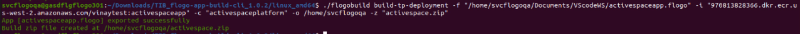

## Import, Deploy build.zip and Run the Application on Tibco Control Plane

1. Import the generated build.zip file in your Data plane on Tibco Control Plane using Import App Build option on Flogo capability page.

      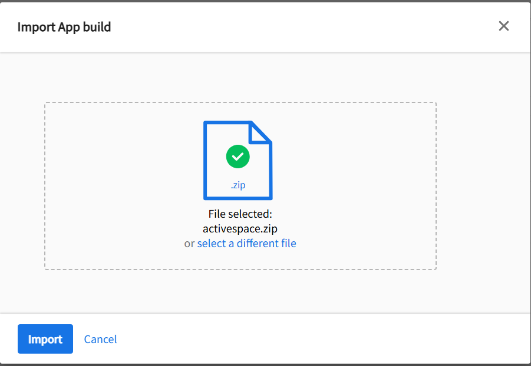

      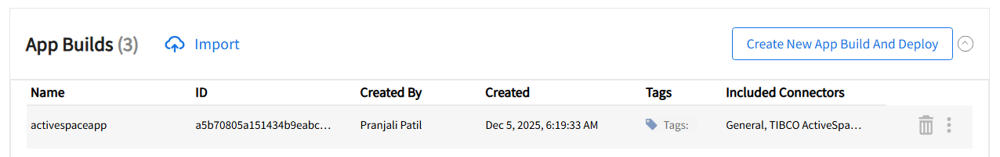
      
      Here don't need to provision Flogo build, Tibco ActiveSpaces connector.
      
2. Specify imagePullSecret for custom app image build deployed using Helm manage way.

      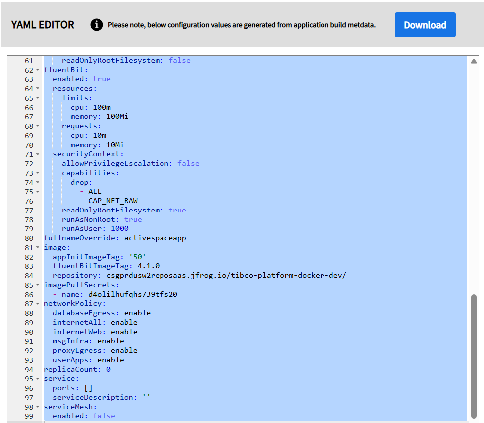

    Here we are using private image hence need to specify imagePullSecret value in deployment YAML.

3. Start application, and check the logs.

      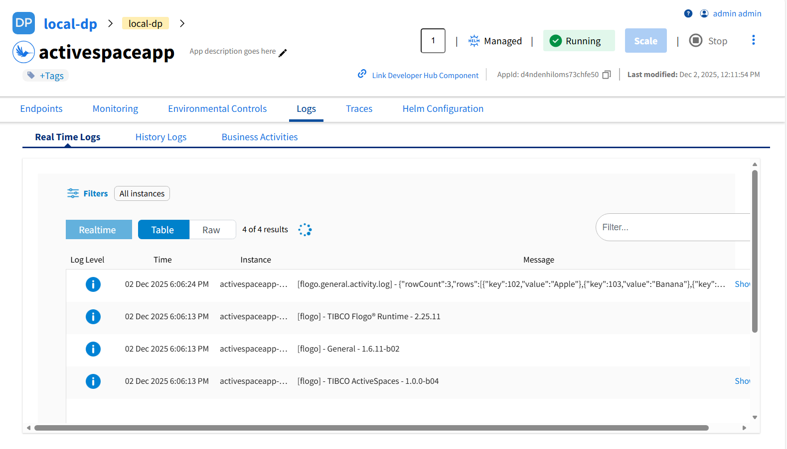


## Understanding Dockerfile and start.sh file configuration

### Understanding Dockerfile

In the Dockerfile,
1. Base Image:
    
    ```dockerfile
    FROM ubuntu:22.04

    ```

    Uses ubuntu:22.04 as the base image. We used ubuntu:22.04 because it's a stable LTS, glibc-based image fully compatible with ActiveSpaces/FTL libraries

2.  Install dependencies:
    The following Dockerfile section installs all the system-level dependencies required for running the ActiveSpaces and FTL libraries, extracting installation packages, and supporting runtime operations:

    RUN apt-get update && DEBIAN_FRONTEND=noninteractive apt-get install -y \
        curl \
        unzip \
        tar \
        gzip \
        libuuid1 \
        openssl \
        procps \
        libc6 \
        libnsl-dev \
        libstdc++6 \
        apache2 \
        net-tools \
        inetutils-ping \
        lsb-release \
        software-properties-common \
    && apt-get clean && rm -rf /var/lib/apt/lists/*


3. Set Environment Variables:
  
    ```dockerfile
    ENV TIBCO_HOME=/opt/tibco
    ENV TIBCO_FTL=$TIBCO_HOME/ftl/7.0
    ENV TIBCO_AS=$TIBCO_HOME/as/4.10
    ENV LD_LIBRARY_PATH=$TIBCO_AS/lib:$TIBCO_FTL/lib:$TIBCO_AS/lib64:/usr/lib:/lib

    ```

    # Ensure dynamic linker knows about TIBCO libs
    RUN echo "$TIBCO_AS/lib" > /etc/ld.so.conf.d/tibco-as.conf && \
    echo "$TIBCO_AS/lib64" >> /etc/ld.so.conf.d/tibco-as.conf && \
    echo "$TIBCO_FTL/lib" > /etc/ld.so.conf.d/tibco-ftl.conf && \
    ldconfig


4.  Download & Install FTL 7.0 (.deb) and ActiveSpaces 4.10 (.deb) :
    
    ```dockerfile
    WORKDIR /opt/tibco
    RUN curl -O http://reldist.tibco.com/package/ftl/7.0.0/V11-GA/TIB_ftl_7.0.0_linux_x86_64.zip && \
    unzip TIB_ftl_7.0.0_linux_x86_64.zip && \
    rm TIB_ftl_7.0.0_linux_x86_64.zip && \
    dpkg -i TIB_ftl_7.0.0/deb/*.deb || true && \
    rm -rf TIB_ftl_7.0.0

    ```
    RUN curl -O http://reldist.tibco.com/package/as/4.10.0/V5-GA/TIB_as_4.10.0_linux_x86_64.zip && \
    unzip TIB_as_4.10.0_linux_x86_64.zip && \
    rm TIB_as_4.10.0_linux_x86_64.zip && \
    dpkg -i TIB_as_4.10.0/deb/*.deb || true && \
    rm -rf TIB_as_4.10.0 && \
    ldconfig


    Installs required packages (like bash, curl, unzip, ActiveSpaces dependencies).
    --no-cache prevents saving package index to reduce image size.
    Downloads the ftl and Activespaces ZIP file. Unzips the archive. Removes the ZIP to reduce image size.
    


5. Set Application Directory & Copy Files:
    
    ```dockerfile
    WORKDIR /app
    COPY activespaceapp /app/activespaceapp
    COPY start.sh /app/start.sh

    ```

    Sets working directory for your app. Copies the start script and app binary (activespaceapp) into the image.

6. Set Permissions:
    
    ```dockerfile
    RUN chmod +x /app/activespaceapp /app/start.sh
    ```

    Gives ownership of all relevant folders to the flogo user. Makes the script and binary executable.

7. Switch to Non-Root User and Define Entrypoint:
    
    ```dockerfile
    ENTRYPOINT ["/app/start.sh"]

    ```

    Runs the application as the non-root user flogo for better security practices. Defines the command to run when the container starts — the start.sh script, which likely starts the application.
 
### Understanding start.sh file

1. Shebang:
    
    ```sh
    #!/usr/bin/env bash
    ```
  
    Specifies the script should run using the Bash shell, located via the environment (env). Ensures compatibility across different systems.

2. Print a banner to the console showing the start message, the HOSTNAME environment variable value, and where logs will go. (HOSTNAME is typically set by the environment; if not set it will print empty.)
      
     echo "=========================================================="
     echo "  Starting ActiveSpace Connector Flogo App"
     echo "  Host: $HOSTNAME"
     echo "  Logs: /app/logs/${HOSTNAME}/flogoapp/"
     echo "=========================================================="

3. Create Log Directory:
    
    ```sh
    mkdir -p /app/logs/${HOSTNAME}/flogoapp
    ```
    
    * Creates a directory structure for logs. 
    * Uses the environment variable HOSTNAME to create a unique subdirectory for the current container or host.
    * The -p flag ensures parent directories are created if they don't exist, and avoids errors if the directory already exists.


3. Set Default Environment Variable:
    
    ```sh
    export FLOGO_FILES_ROOT_DIR="${FLOGO_FILES_ROOT_DIR:-/tmp/flogo}"
    ```

  * Sets the environment variable FLOGO_FILES_ROOT_DIR if not already set.
  * Uses /tmp/flogo as the default directory for Flogo files.
  * Allows users to override this by setting FLOGO_FILES_ROOT_DIR before running the script.

4. # ActiveSpaces + FTL library paths

   export LD_LIBRARY_PATH="/opt/tibco/as/4.10/lib:/opt/tibco/ActiveSpaceConnector/lib:/opt/tibco/ftl/7.0/lib:/usr/lib64:/lib64:$LD_LIBRARY_PATH"

    Set LD_LIBRARY_PATH so the dynamic linker can find the required native/shared libraries (ActiveSpaces, FTL, connector libs). It prepends the required folders and appends the existing $LD_LIBRARY_PATH so previously set locations are preserved.

5. echo "LD_LIBRARY_PATH: $LD_LIBRARY_PATH"
   echo "----------------------------------------------------------"
   
   Print the final LD_LIBRARY_PATH so an operator can verify it at startup.

6. if ! command -v rotatelogs >/dev/null 2>&1; then
  echo "ERROR: rotatelogs not found. Install httpd-tools in Dockerfile."
  exit 1
fi  

    * command -v rotatelogs checks if the rotatelogs command is available in the PATH.
    * If it is not found, the script prints an error.
    * The script then exits, preventing the application from starting without proper log rotation support.


7. Start Application and Manage Logs:

    ```sh
    ./activespaceapp 2>&1 | tee >(rotatelogs -t /app/logs/${HOSTNAME}/flogoapp/otel.log 10M)
    ```

  * Runs the activespace binary located in the current directory.
  * Redirects both stdout and stderr (2>&1) so all output is captured.
  * Pipes the output to tee, which splits it:
    * One copy goes to the console (standard output).
    * The other copy is sent to rotatelogs.
  * rotatelogs manages the logs by rotating them when they reach 10MB (10M), keeping log files manageable and organized.
  * Logs are saved under /app/logs/${HOSTNAME}/flogoapp/otel.log, matching the directory created earlier.


## Outputs

Custom App Image run for Tibco ActiveSpaces


## Troubleshooting

* AWS ECR–specific note:

* If you see ImagePullBackOff with ECR:
  Make sure:
  * Your imagePullSecret name is correct  
  * Secret exists in the same namespace  
  * Secret points to the correct AWS registry URL  

* If you see an error like:  
  `Failed to import build with error: failed to retrieve buildtypes catalog json: stat /data/d24a8ji3ndns73da7pf0/tibco/flogo/base/catalog.json: no such file or directory`  
  then make sure you have provisioned Flogo build.


## Help

Please visit our [TIBCO Flogo<sup>&trade;</sup> Extension for Visual Studio Code documentation](https://docs.tibco.com/products/tibco-flogo-extension-for-visual-studio-code-latest) and [App Build on TIBCO Control Plane documentation](https://docs.tibco.com/pub/platform-cp/latest/doc/html/Subsystems/flogo-capability/flogo-capability.htm#flogo-user-guide/app-builds.htm) for additional information.

